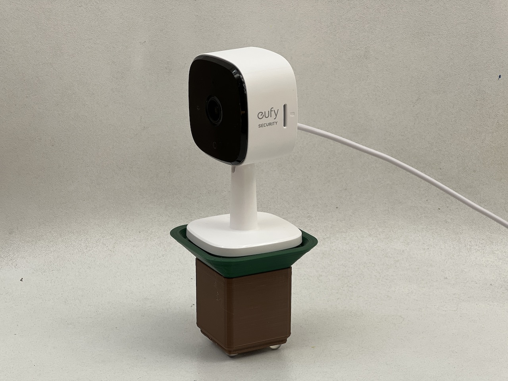
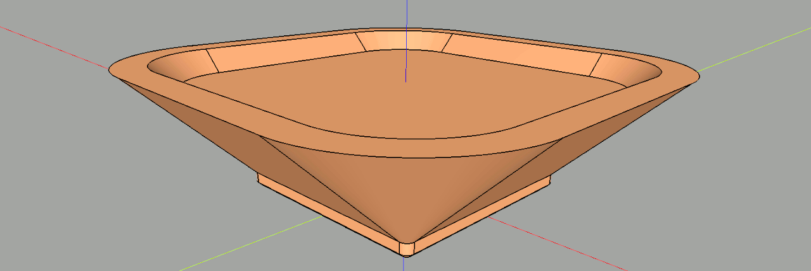

# Gridfinity Eufy Solo IndoorCam C24 v2

[Gridfinity](https://gridfinity.xyz/) is a modular, open-source grid storage system for your workshop that lets you display your tools and parts for quick access and retrieval. It consists of a gridded baseplate that can hold bins of different sizes and shapes.

The [Eufy Solo IndoorCam C24](https://us.eufy.com/products/t84001w1) is a cheap home security camera that supports voice assistants and has a night vision mode.

This project combines the two to let you easily stack an IndoorCam C24 on top of a Gridfinity bin. It's perfect for positioning your camera to monitor your magical 3D printer.

The [first version](https://www.printables.com/model/430343-gridfinity-eufy-solo-indoorcam-c24) of this remixed two models by squishing them together, whereas I designed version 2 myself from scratch in [CadQuery](https://cadquery.readthedocs.io/en/latest/intro.html).

Download this model today and monitor away!

<https://www.printables.com/model/435279-gridfinity-eufy-solo-indoorcam-c24-v2>

## License

CC BY-NC-SA 4.0

## Author

Leon Brocard <acme@astray.com>
